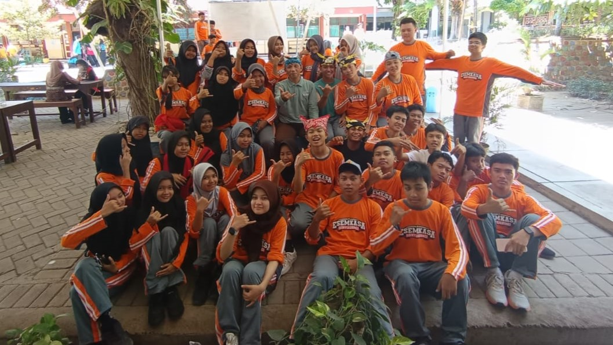

<html>
 <head>
  <title>
   PPLG 2
  </title>
  <link href="https://cdnjs.cloudflare.com/ajax/libs/font-awesome/5.15.3/css/all.min.css" rel="stylesheet"/>
  <link href="https://fonts.googleapis.com/css2?family=Roboto:wght@400;700&amp;display=swap" rel="stylesheet"/>
  <link rel="stylesheet" href="pplg2.css">
 </head>
 <body>
  

   
   

    <h1>
     PPLG 2
    </h1>
    

     Dapatkan lebih banyak informasi tentang kami dan ikuti cerita
      
     kerandoman kami semua
    

   

  

  

   <a href="Samping/absensi.html" class="item">
    <i class="fas fa-calendar-check">
    </i>
    

     ABSENSI SISWA
    

</a>
   <a href="Samping/struktur.html" class="item">
    <i class="fas fa-users-cog">
    </i>
    

     STRUKTUR ORGANISASI KELAS
    

</a>
   <a href="Samping/profil.html" class="item">
    <i class="fas fa-user-graduate">
    </i>
    

     PROFIL SISWA
    

</a>
   <a href="Samping/kas.html" class="item">
    <i class="fas fa-dollar-sign">
    </i>
    

     KAS
    

</a>
  

  

    

        
Sekilas informasi terkait pplg

        
Sekilas informasi terkait pplg

        
Sekilas informasi terkait pplg

        
Sekilas informasi terkait pplg

        
Sekilas informasi terkait pplg

    

  

   <h2 class="kata2">
    First step towards the future!!
   </h2>
   

    

     
     

       
      Lomba Agustusan
     

    

    

     
     

       
      Pilkasa 2024
     

    

    

     
     

       
      Maulid Nabi Muhammad SAW
     

    

   

  

  

    
Information

    

    

    <a class="item">
      <i class="fas fa-calendar-check">
      </i>
      

       Tanggal : 17 Agustus 1945
        
        
       Isi Informasi : 
        
        
       17 Agustus diperingati sebagai Hari Ulang Tahun (HUT) Kemerdekaan Republik Indonesia (RI). Pada tanggal 17 Agustus 1945, Indonesia memproklamasikan kemerdekaannya dari penjajahan. Peringatan HUT RI memiliki makna yang mendalam bagi setiap warga negara Indonesia, di antaranya: 
Menghargai jasa-jasa para pahlawan yang telah berjuang tanpa pamrih 
Menumbuhkan rasa nasionalisme di kalangan generasi muda 
Menandakan kelahiran sumber hukum di Indonesia yang mengatur ketatanegaraan secara menyeluruh 
Cita-cita bangsa yang tercantum dalam proklamasi kemerdekaan menjadi arah gerak bangsa 
Pada tahun 2024, peringatan HUT ke-79 Kemerdekaan RI mengusung tema "Nusantara Baru, Indonesia Maju". Tema ini menyiratkan semangat baru yang besar dengan persatuan dan kesetaraan untuk mencapai segala tujuan. 
Beberapa kegiatan yang dilakukan dalam rangka memperingati HUT RI, di antaranya:
Upacara bendera
Membunyikan sirine dan tembakan kehormatan
Membaca teks proklamasi
Mengheningkan cipta
Membaca doa
Paskibraka mengibarkan Sang Merah Putih
      

  </a>

  

   

    <h3>
     36
    </h3>
    

     Jumlah Siswa
    

   

   

    <h3>
     18
    </h3>
    

     Laki - Laki
    

   

   

    <h3>
     18
    </h3>
    

     Perempuan
    

   

   

    <h3>
     6
    </h3>
    

     Pengurus Kelas
    

   

  

  

   <h2>
    PPLG 2
   </h2>
    
   <h3>Sosial Media Kami</h3>
   

    

     <i class="fab fa-instagram">
     </i>
     xplg.two2_
    

    

     <i class="fab fa-whatsapp">
     </i>
     Chat si Admin ~~~> 082232191294
    

   

  

 </body>
</html>
